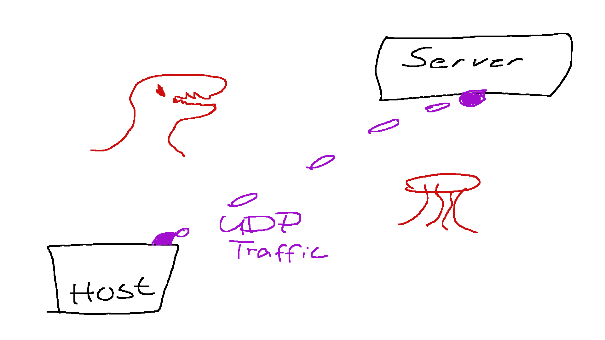
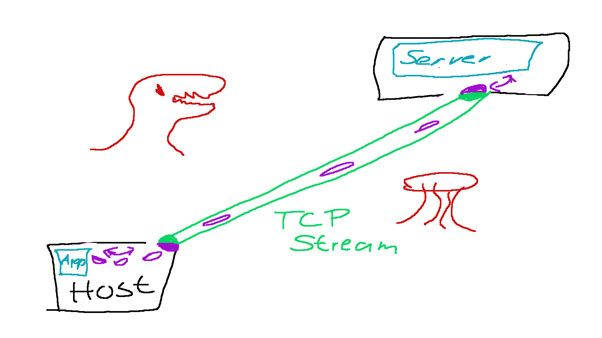

# UDPtunnel

A simple solution to tunnel UDP over TCP connections, while preserving packet boundaries.

Before:

After:

# Use Case

Usually its not a good idea to tunnel UDP over TCP - the original developers likely
chose UDP for a reason.

However, when faced with certain residential ISPs that will start dropping up to 90% (!)
of UDP traffic during heavily congested traffic hours, the equation changes and anything
using UDP connections can see horribly bad network lag, while the rest of the internet
appears to work absolutely fine.

In order to play some popular multiplayer games in this situation, tunneling the traffic
in such a way makes sense.

# How it Works

Inspired by `sshuttle`, the `udptunnel` will copy itself to a remote host and run
there as a server binary. On the local side, udp packets are received and send
through the tcp connection with a length prepended. On the remote side, packets
are read from the TCP connection and re-sent as UDP packets once they're fully transmitted.

Note that the tunnel is not encrypted, so if the original UDP data was transmitted in
plain text, the TCP data will be transmitted in plain text as well.

# Words of Warning

This program was written for a very specific purpose and the source code is shitty.

Use at your own risk.
